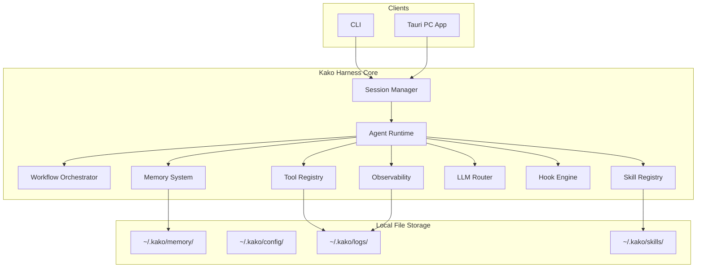
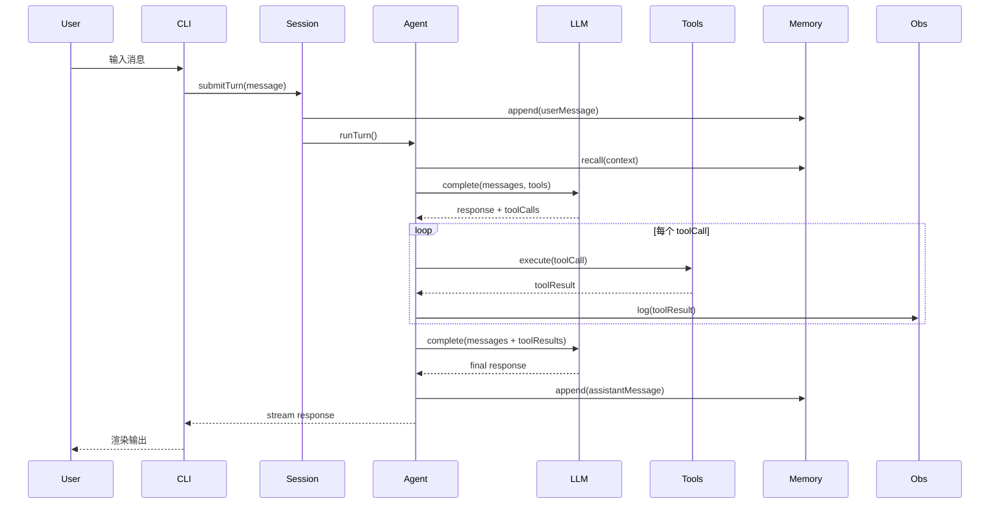
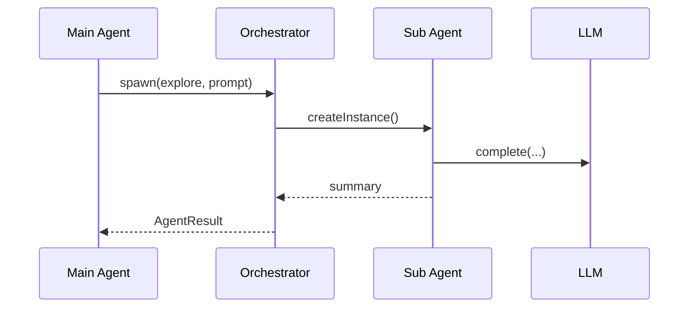

# 系统架构

## 架构总览



## 模块职责

| 模块 | 包 | 职责 |
|------|-----|------|
| Session Manager | `@kako/core` | 会话生命周期、上下文注入 |
| Agent Runtime | `@kako/core` | Agent 执行循环、工具调用、递归 |
| LLM Router | `@kako/core` | 多供应商路由、流式、重试 |
| Tool Registry | `@kako/core` | Tool 注册、沙箱执行、权限 |
| Skill Registry | `@kako/core` | Skill 发现、激活、执行 |
| Memory System | `@kako/core` | 多层记忆读写、consolidation |
| Orchestrator | `@kako/core` | 串行/并行/Workflow 编排 |
| Hook Engine | `@kako/core` | 生命周期事件分发 |
| Observability | `@kako/core` | 事件、日志、追踪 |
| Shared Types | `@kako/shared` | 跨包类型定义 |
| CLI | `@kako/cli` | 命令行入口 |
| Desktop | `@kako/desktop` | Tauri UI |

## 核心数据流

### 单轮对话



### 子 Agent 委派



## 依赖关系

```
@kako/cli ──→ @kako/core ──→ @kako/shared
@kako/desktop ──→ @kako/core ──→ @kako/shared
```

`@kako/core` 不依赖 UI 框架，可被 CLI、Tauri、未来 Server 复用。

## 扩展点

| 扩展点 | 方式 | Phase |
|--------|------|-------|
| 新 LLM 供应商 | 实现 `LLMProvider` adapter | 1+ |
| 新 Tool | 注册 `ToolDefinition` + handler | 1+ |
| 新 Skill | 安装 SKILL.md 目录 | 2+ |
| 新 Hook | 注册 `HookHandler` | 2+ |
| MCP 外部工具 | MCP client 桥接到 Tool Registry | 3 |
| 远程 Server | HTTP/WS API 暴露 Harness | 3 |

## 技术选型

| 领域 | 选择 |
|------|------|
| 语言 | TypeScript（全栈） |
| 包管理 | pnpm workspace + turborepo |
| 构建 | tsup |
| 测试 | vitest |
| 配置 | YAML + zod 校验 |
| 桌面 | Tauri 2 + React + Tailwind |
| 本地存储 | 文件系统 + SQLite 索引 |
