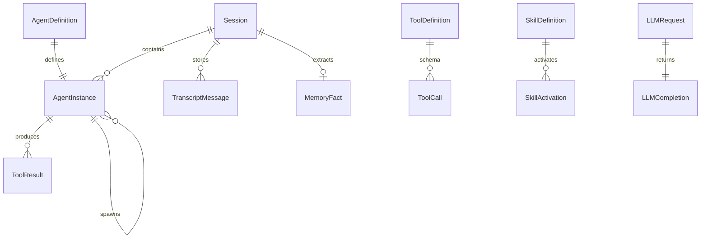

# 数据模型

## 概述

核心 TypeScript 类型定义在 `@kako/shared` 包中。本文档描述各模块的关键数据模型及其关系。

> 实现代码：`packages/shared/src/`

## 实体关系



## Agent

```typescript
interface AgentDefinition {
  name: string;
  description: string;
  model: string;
  systemPrompt: string;
  tools?: string[];
  disallowedTools?: string[];
  skills?: string[];
  permissionMode?: PermissionMode;
  maxTurns?: number;
  hooks?: AgentHooks;
  subagents?: string[];
}

interface AgentInstance {
  id: AgentId;
  definition: AgentDefinition;
  sessionId: SessionId;
  parentToolUseId?: ToolUseId;
  runId: RunId;
  startedAt: string;
  status: AgentStatus;
}
```

## Session

```typescript
interface Session {
  id: SessionId;
  agentName: string;
  status: SessionStatus;
  createdAt: string;
  updatedAt: string;
  cwd: string;
  metadata?: Record<string, unknown>;
}
```

## Tool

```typescript
interface ToolDefinition {
  name: string;
  description: string;
  inputSchema: JsonSchema;
  outputSchema?: JsonSchema;
  requiresConfirmation?: boolean;
  sandbox?: ToolSandbox;
}

interface ToolCall {
  id: ToolUseId;
  name: string;
  input: Record<string, unknown>;
}

interface ToolResult {
  toolUseId: ToolUseId;
  name: string;
  input: Record<string, unknown>;
  output: unknown;
  status: ToolResultStatus;
  error?: string;
  durationMs: number;
  agentId: AgentId;
  sessionId: SessionId;
}
```

## Skill

```typescript
interface SkillMetadata {
  name: SkillId;
  description: string;
  path: string;
}

interface SkillDefinition extends SkillMetadata {
  instructions: string;
  scripts?: string[];
  references?: string[];
  assets?: string[];
}
```

## Memory

```typescript
type MemoryLayer = "L0" | "L1" | "L2" | "L3" | "L4" | "L5";

interface TranscriptMessage {
  id: string;
  role: "user" | "assistant" | "system" | "tool";
  content: string;
  timestamp: string;
  toolCallId?: string;
  toolName?: string;
}

interface MemoryFact {
  id: string;
  content: string;
  confidence: number;
  source: string;
  validFrom?: string;
  validTo?: string;
  createdAt: string;
  updatedAt: string;
}

type FactMergeAction = "ADD" | "UPDATE" | "DELETE" | "NOOP";
```

## LLM

```typescript
interface LLMMessage {
  role: "system" | "user" | "assistant" | "tool";
  content: string | LLMContentBlock[];
  toolCallId?: string;
  name?: string;
}

interface LLMCompletion {
  content: string;
  toolCalls?: ToolCall[];
  finishReason: "stop" | "tool_calls" | "length" | "error";
  usage: LLMTokenUsage;
  model: string;
  provider: LLMProviderId;
}

interface LLMStreamChunk {
  type: "text_delta" | "tool_call_delta" | "done" | "error";
  text?: string;
  toolCall?: Partial<ToolCall>;
  usage?: LLMTokenUsage;
  error?: string;
}
```

## Hook

```typescript
type HookEvent =
  | "SessionStart"
  | "UserPromptSubmit"
  | "PreToolUse"
  | "PostToolUse"
  | "PostToolUseFailure"
  | "SubagentStart"
  | "SubagentStop"
  | "Stop"
  | "SessionEnd";

interface HookResult {
  allow: boolean;
  modifiedInput?: Record<string, unknown>;
  message?: string;
}
```

## Observability

```typescript
interface ToolLogEntry {
  timestamp: string;
  sessionId: SessionId;
  agentId: AgentId;
  toolUseId: ToolUseId;
  toolName: string;
  input: Record<string, unknown>;
  output?: unknown;
  status: ToolResultStatus;
  durationMs: number;
}

interface AgentRunNode {
  runId: RunId;
  agentId: AgentId;
  agentName: string;
  parentRunId?: RunId;
  parentToolUseId?: ToolUseId;
  status: string;
  startedAt: string;
  endedAt?: string;
  children: AgentRunNode[];
  tokenUsage?: LLMTokenUsage;
}
```

## ID 类型

| 类型 | 格式示例 | 说明 |
|------|----------|------|
| `SessionId` | `sess-abc123` | 会话唯一标识 |
| `AgentId` | `agent-main` | Agent 实例 ID |
| `RunId` | `run-001` | 单次 Agent 运行 ID |
| `ToolUseId` | `tu-001` | 工具调用 ID |
| `SkillId` | `brainstorming` | Skill 名称 |

## 配置 Schema（YAML → zod）

Phase 1 实现时用 zod 校验以下配置：

- `providers.yaml` → `LLMProviderConfig[]`
- `agents.yaml` → `Partial<AgentDefinition>[]`
- `skills.yaml` → slash command 映射
