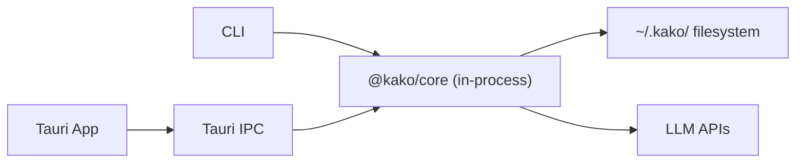
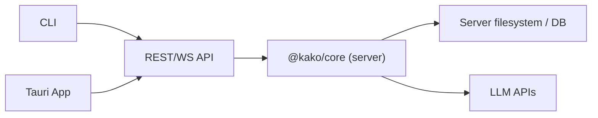

# 部署模式

## 概述

Kako 首版以**本地模式**为主：Harness 在用户机器上运行，数据存储在 `~/.kako/`。架构保留**远程 Server 模式**扩展点，供 Phase 3 实现。

## 本地模式（默认）



### 特点

- 零网络依赖（除 LLM API 调用）
- 数据完全本地，用户掌控
- CLI 与 App 通过进程内调用或 Tauri IPC 访问 Core
- 适合个人开发者日常使用

### 数据流

1. 用户通过 CLI 或 App 发起对话
2. `@kako/core` 在本地进程内执行 Agent 循环
3. 记忆、日志写入 `~/.kako/`
4. LLM 调用直连供应商 API

## 远程 Server 模式（Phase 3 扩展）



### 特点

- Harness 运行在远程服务器
- 客户端（CLI/App）通过 API 交互
- 支持多用户、团队共享（未来）
- 适合 CI/CD 集成、远程开发

### API 设计（草案）

| 端点 | 方法 | 说明 |
|------|------|------|
| `/sessions` | POST | 创建会话 |
| `/sessions/{id}/turns` | POST | 提交一轮对话 |
| `/sessions/{id}/stream` | WS | 流式响应 |
| `/agents` | GET | 列出 Agent |
| `/skills` | GET/POST | Skill 管理 |
| `/memory/recall` | POST | 记忆查询 |
| `/logs/tools` | GET | 工具日志 |

### 协议选择（待确认）

| 选项 | 优点 | 缺点 |
|------|------|------|
| REST + SSE | 简单、兼容性好 | 双向通信弱 |
| WebSocket | 全双工流式 | 连接管理复杂 |
| gRPC | 高性能、强类型 | 浏览器支持需 grpc-web |

**建议**：REST + WebSocket 混合 — REST 用于 CRUD，WebSocket 用于流式对话。

## 模式切换

```yaml
# ~/.kako/config/server.yaml
mode: local  # local | remote

remote:
  url: https://kako.example.com
  apiKey: ${KAKO_API_KEY}
```

CLI 和 App 读取配置决定连接本地 Core 还是远程 API。`@kako/core` 暴露统一接口，客户端无感切换。

## 安全考虑

| 模式 | 考量 |
|------|------|
| 本地 | API Key 存 `~/.kako/config/`，文件权限 600 |
| 远程 | HTTPS + API Key 认证；敏感操作需二次确认 |
| 通用 | Tool 沙箱限制 cwd、timeout；日志脱敏 |

## Phase 划分

| 能力 | Phase |
|------|-------|
| 本地 in-process 模式 | 1 |
| Tauri IPC 桥接 | 2 |
| 远程 Server API 设计 | 3 |
| 远程 Server 实现 | 3 |
| 多用户 / 团队 | 未来 |
