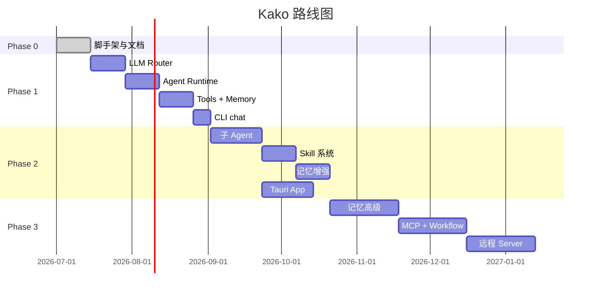

# 迭代路线图

## Phase 0 — 文档与脚手架 ✅

**目标**：建立项目基础，定义接口与文档体系。

- [x] Monorepo 脚手架（pnpm + turborepo）
- [x] `packages/shared` 核心 TypeScript 接口
- [x] `packages/core` / `packages/cli` / `apps/desktop` 空壳
- [x] 需求文档（10 份 PRD）
- [x] 架构文档（4 份）
- [x] 开发指南 + 路线图
- [x] ADR-001 / ADR-002
- [ ] Tool 定义逐项确认
- [ ] Agent system prompt 确认

**交付物**：可构建的 monorepo + 完整文档体系。

---

## Phase 1 — 最小可用 Harness（MVP）🚧

**目标**：`kako chat` 可完成带工具的多轮对话。

### 核心功能

| 功能 | 说明 | 状态 |
|------|------|------|
| LLM Router | OpenAI + Anthropic adapter，流式输出 | ✅ |
| Session Manager | 创建/管理会话，注入项目上下文 | ✅ |
| Agent Runtime | 单 Agent 执行循环（main） | ✅ |
| Tools | Read, Write, Bash | ✅ |
| Memory L0/L1 | transcript 追加 + session summary | ✅ |
| Tool 日志 | JSONL 写入 `~/.kako/logs/tools/` | ✅ |
| CLI | `kako chat` REPL | ✅ |

### 里程碑

1. LLM Router 可调用 OpenAI/Anthropic
2. Agent 循环：user → LLM → tool → LLM → response
3. Read/Write/Bash 工具可执行
4. 会话 transcript 持久化
5. `kako chat` 流式 REPL 可用

### 预估工期

4–6 周

---

## Phase 2 — 多 Agent + Skill + 记忆增强

**目标**：子 Agent 委派、Skill 生态、增强记忆、桌面 UI。

### 核心功能

| 功能 | 说明 |
|------|------|
| 子 Agent | explore / plan / general-purpose |
| 并行编排 | 多子 Agent 并发执行 |
| Skill 系统 | 发现、激活、安装 |
| Memory L2/L3 | rolling summary + 事实提取 |
| Hook 系统 | PreToolUse / PostToolUse |
| 更多 Tools | Edit, Glob, Grep, Agent, Skill |
| 更多 LLM | Google, Azure, OpenRouter, Ollama |
| Tauri App | 对话页 + 日志页 + 运行树 |
| CLI 扩展 | `kako agent run`, `kako skill install` |

### 里程碑

1. 子 Agent spawn 与 summary 返回
2. Skill 发现与激活流程
3. L3 事实 ADD/UPDATE/DELETE
4. Tauri 对话界面可用
5. 工具/Skill 日志可在 App 查看

### 预估工期

6–8 周

---

## Phase 3 — 高级能力与生态

**目标**：记忆高级机制、MCP、Workflow、远程 Server、生态建设。

### 核心功能

| 功能 | 说明 |
|------|------|
| 记忆高级 | 对抗、遗忘、梦境 |
| MCP 集成 | 外部 Tool Server 即插即用 |
| Workflow DSL | YAML 定义复杂流程 |
| 远程 Server | REST/WS API 暴露 Harness |
| Skill Registry | 生态 Skill 安装与分发 |
| 安装引导 | 首次启动 wizard |
| Worktree 隔离 | 子 Agent git worktree |
| Background Agent | 长任务后台运行 |
| 成本仪表盘 | Token 用量与成本 |
| Checkpoint | 长流程暂停/恢复 |

### 里程碑

1. MCP client 桥接外部工具
2. Workflow YAML 可执行
3. 远程 Server 模式可用
4. Skill registry 可浏览安装
5. 安装引导 wizard 完成

### 预估工期

8–12 周

---

## 依赖关系

## 风险与缓解

| 风险 | 影响 | 缓解 |
|------|------|------|
| LLM API 变更 | adapter 需频繁更新 | 统一接口 + 版本锁定 |
| Tauri 跨平台兼容 | 桌面 App 延迟 | Phase 2 先 macOS，后扩展 |
| 记忆质量 | 事实提取不准确 | 对抗机制 + 用户可编辑 |
| 范围膨胀 | 延期 | 严格按 Phase 交付，MVP 优先 |
