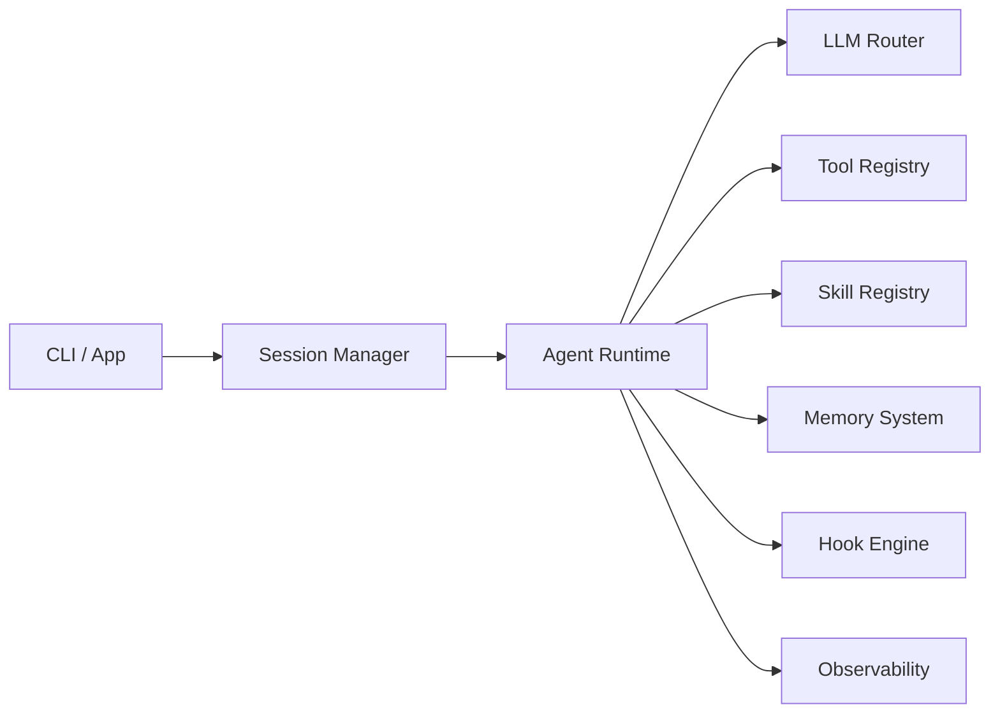

# 功能需求总览

## 模块清单与优先级

| 模块 | PRD | 优先级 | Phase |
|------|-----|--------|-------|
| 客户端（CLI + App） | [08-clients.md](./08-clients.md) | P0 | 1–2 |
| LLM 路由 | [06-llm.md](./06-llm.md) | P0 | 1 |
| Agent 管理 | [03-agent.md](./03-agent.md) | P0 | 1–2 |
| Tools 系统 | [04-tools.md](./04-tools.md) | P0 | 1–2 |
| 记忆系统 | [02-memory.md](./02-memory.md) | P1 | 1–3 |
| Skill 管理 | [05-skills.md](./05-skills.md) | P1 | 2 |
| 工作流编排 | [07-orchestration.md](./07-orchestration.md) | P1 | 2–3 |
| Hook 系统 | 03-agent / 04-tools | P2 | 2 |
| MCP 注册与调用 | [10-mcp.md](./10-mcp.md) | P0 | 1.5 ✅ |
| 供应商 Web UI | [06-llm.md](./06-llm.md) | P0 | 1.5 ✅ |

## Phase 0 — 文档与脚手架（当前）

- [x] Monorepo 脚手架（pnpm + turborepo）
- [x] 需求 / 架构 / 开发文档
- [x] `@kako/shared` 核心 TypeScript 接口
- [ ] Tool 定义逐项确认
- [ ] Agent system prompt 确认

## Phase 1 — 最小可用 Harness（MVP）

- LLM Router（OpenAI + Anthropic）
- 单 Agent REPL：`kako chat`
- 基础 Tools：Read, Write, Bash
- L0/L1 记忆（transcript + session summary）
- Tool 调用日志

## Phase 2 — 多 Agent + Skill + 记忆增强

- 子 Agent 递归与并行
- Skill 发现 / 激活 / 安装
- L2/L3 记忆 + 事实 ADD/UPDATE/DELETE
- Hook 系统（PreToolUse / PostToolUse）
- Tauri App 基础 UI

## Phase 3 — 高级能力与生态

- 对抗 / 遗忘 / 梦境记忆机制
- MCP 集成
- Workflow DSL
- 可选远程 Server 模式
- Skill 生态 registry
- 安装引导 wizard

## 跨模块依赖

## 参考能力（Backlog）

以下能力参考 Claude Code，纳入后续迭代：

- Project Context 文件（`KAKO.md`）
- Permission 模式与工具确认 UI
- Git Worktree 隔离
- MCP 协议
- Background Agent
- 斜杠命令
- Plugin 机制
- Plan Mode
- Checkpoint / 会话恢复
