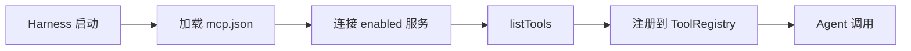

# MCP 系统 PRD

## 概述

Kako 支持 **MCP（Model Context Protocol）** 外部工具服务注册与调用。MCP 工具自动桥接到 Harness Tool Registry，Agent 可像内置工具一样调用。

## 能力

| 能力 | 说明 | 状态 |
|------|------|------|
| MCP 服务注册 | stdio / SSE 传输 | ✅ |
| 工具发现 | `listTools` 自动同步 | ✅ |
| 工具调用 | `callTool` 桥接到 Agent 循环 | ✅ |
| Web UI 管理 | 添加/删除/重连 MCP 服务 | ✅ |
| Hook 审计 | PostToolUse 记录 MCP 调用 | Phase 2 |

## 配置

`~/.kako/config/mcp.json`：

```json
{
  "version": 1,
  "servers": [
    {
      "id": "filesystem",
      "name": "Filesystem",
      "enabled": true,
      "transport": "stdio",
      "command": "npx",
      "args": ["-y", "@modelcontextprotocol/server-filesystem", "/Users/me/projects"]
    }
  ]
}
```

## 工具命名

MCP 工具在 Harness 中以统一前缀暴露：

```
mcp/{serverId}/{toolName}
```

示例：`mcp/filesystem/read_file`

## 传输类型

| 类型 | 场景 |
|------|------|
| `stdio` | 本地子进程（npx、python 等） |
| `sse` | 远程 HTTP SSE MCP 服务 |

## API

| 端点 | 方法 | 说明 |
|------|------|------|
| `/api/mcp` | GET | 列出 MCP 服务 |
| `/api/mcp` | POST | 添加/更新 MCP 服务 |
| `/api/mcp/:id` | DELETE | 删除 MCP 服务 |
| `/api/mcp/tools` | GET | 列出已连接 MCP 工具 |
| `/api/mcp/reconnect` | POST | 重新连接全部服务 |

## 生命周期



## Phase 划分

| 能力 | Phase |
|------|-------|
| stdio MCP 注册与调用 | 1.5 ✅ |
| Web UI 管理 | 1.5 ✅ |
| SSE 远程 MCP | 1.5 ✅ |
| per-agent MCP 白名单 | 2 |
| MCP 调用日志独立展示 | 2 |
